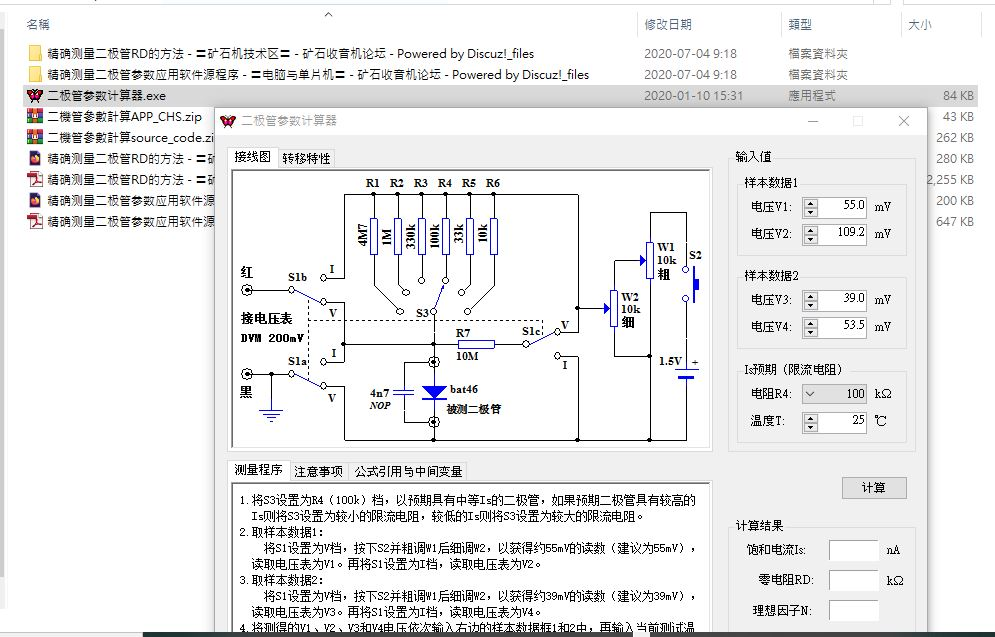

# Diode_Equation_Id_Is_measurement  
Dynamic resistance of diode for measurement and calculation. clone, see original source described following,  

### [oroginal source code, C#, 精确测量二极管参数应用软件源程序](http://www.crystalradio.cn/forum.php?mod=viewthread&tid=1828102&extra=page%3D1)  
### [how to uses, 精确测量二极管Rd的方法,](http://www.crystalradio.cn/forum.php?mod=viewthread&tid=1828102&extra=page%3D1)    

  
### [reference, A Procedure for Measuring the Saturation Current and Ideality Factor of a Diode, along with Measurements on various diodes](http://kearman.com/bentongue/xtalset/16MeaDio/16MeaDio.html)  
  
### [my notes, Diode Equation, 二極管的 IV 方程式](https://xiaolaba.wordpress.com/2019/10/28/diode-equation-%e4%ba%8c%e6%a5%b5%e7%ae%a1%e7%9a%84-iv-%e6%96%b9%e7%a8%8b%e5%bc%8f/)  

### [my experiment, Diode Equation, 二極管的 IV 方程式, 實驗測量動態電阻](https://xiaolaba.wordpress.com/2020/05/31/diode-equation-%e4%ba%8c%e6%a5%b5%e7%ae%a1%e7%9a%84-iv-%e6%96%b9%e7%a8%8b%e5%bc%8f-%e5%af%a6%e9%a9%97%e6%b8%ac%e9%87%8f%e5%8b%95%e6%85%8b%e9%9b%bb%e9%98%bb/)  

### The APP (CHS version) and visual
  

